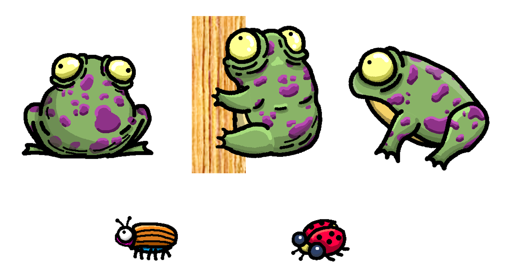

## INTRODUCCIÓ

FROGGY PANG és un joc inspirat en el famós PANG però ambientat en un gripau que pot saltar i enfilarse per les parets. El teu objectiu és aconseguir eliminar totes les bombolles abans que s'acabi el temps de la partida, i fer els màxims punts possibles! 

El gripau pot tenir diferents tipus de projectil que s'aconsegueixen agafant els pickup que hi ha amagats pels nivells. A més, cada cert temps l'escenari rota 90º, fent que les plataformes canviin la seva disposició i hagis de pensar amb estratègia com moure't!

El joc té un sistema de guardat dels nivells desbloquejats, a fi que el jugador no perdi els nivells assolits si tanca el joc. En aquesta imatge es pot veure els nivells 1 i 2 desbloquejats, i la resta bloquejats:

## FONTS DELS ASSETS UTILITZATS

Ells personatges i les seves animacions (gripau, insectes) i els pickups de diferents coses (excepte l'escut) han esta desenvolupats per mi. Aquí podeu veure els personatges (el gripau en diverses posicions) en detall:

Tots els efectes de partícules també han estat creats per mi, així com les partícules de fulla de les plataformes destructibles.

### Backgrounds:
- Upkylak, a https://www.freepik.com/
- Craftpix: https://craftpix.net/freebies/free-cartoon-forest-game-backgrounds/

### Tiles:
- Game Art 2D: https://www.gameart2d.com/free-desert-platformer-tileset.html
- Game Art 2D: https://www.gameart2d.com/winter-platformer-game-tileset.html

### Música i sfx:
- Frog sfx: AntumDeluge, https://opengameart.org/content/mutant-frog
- Antoinemax: https://opengameart.org/content/nature-sounds-pack
- TinyWorlds: https://opengameart.org/content/we-are-prophet-happy-energetic-tune
- SketchyLogic: https://opengameart.org/content/hungry-dino-9-chiptune-tracks-10-sfx
- Juhani Junkala: https://juhanijunkala.com/ 
- 3xBlast, Harm-Jan Wiechers: https://opengameart.org/content/bleeps-and-synths
- Bart Kelsey: https://opengameart.org/content/8-bit-platformer-sfx
- Rubberduck: https://opengameart.org/content/80-cc0-creature-sfx 

Some sounds were modified using free software Audacity (https://aduducity.org/)

### Font:
- Ahmad Zulfikar Ali: ilarakifluzdamha@gmail.com (https://www.dafont.com/es/cartoonic.font)
- Letterna studios, Balloon Dreams: https://letterena.com/product/ballon-dreams/
- OMAR MOGOLLON-ALAGUNNA (c) 2015, Personal website: http://www.alagunna.com
- Tokokoo studios (https://www.dafont.com/es/fun-blob.font)

### Asset cleaner:
https://github.com/unity-cn/Tool-UnityAssetCleaner

## COM JUGAR
### Aspectes tècnics:
El joc ha estat desenvolupat en la versió 2021.3.10f1 de Unity i Visual Studio 2022. Està pensat per jugar idealment amb un mando (tipus xbox o play), però també es pot jugar amb ratolí i teclat, ja que l'input s'ha dissenyat fent servir el nou Input System de Unity. Per jugar des de l'ordinador, es necessita un teclat i un ratolí.

Controls:

- Moviment: WASD / joystick 
- Saltar: space bar / botó d'abaix del mando (button south del gamepad, A en xbox)
- Disparar: botó esquerre ratolí / botó de dalt del mando (Button north, Y en xbox)
- Dashing: B key / Botó de la dreta del mando (button east, B en xbox)

El joc està dissenyat per jugar des de l'ordinador amb una resolució de 1920x1080, i per jugar en local, ja que té un sistema de guardat en local.

Per jugar des de Unity amb l'ordinador, obriu el projecte amb Unity 2021.3.10f1. El joc ha estat dissenyat per jugar a una resolució de 1920x1080. Per tant, trieu aquesta resolució a la pantalla de joc. Per jugar en local, feu el build en local. Per resetejar els PlayerPrefs (que guarden els nivells desbloquejats/bloquejats) aneu al script LevelLockController.cs, i descomenteu la línia de codi que elimina els PlayerPrefs existents.

### Jugabilitat:

El jugador ha d'aconseguir eliminar totes les bombolles abans que acabi el temps del nivell. La direcció de disparar sempre és cap amunt, com al Pang. Son partides curtes, entre 30-75segons. Quan dispara a una bombolla, aquesta es divideix en dues més petites (com en el Pang), fins que arriba a la mida més petita i quan colisiona amb un projectil, es destrueix. Destruir les bombolles dona punts, però si aquestes toquen al jugador, aquest mor. Cada certs segons, l'escenari rota 90º, canviant la disposició de les plataformes. Això s'ha fet per donar un punt dinàmic i de dificultat al joc, ja que el nivell canvia periòdicament.

Aquí podeu veure l'escenari rotant:

Els nivells tenen elements variats. Hi ha plataformes fixes i indestructibles; n'hi ha de destructibles (i que a vegades donen pickups); i hi ha plataformes mòbils. A més, hi ha diversos tipus de pickups: dos tipus de projectils diferents; dos tipus d'escuts diferents (que otorguen 1 o 2 punts de vida extra al jugador); i pickups de punts que desapareixen als pocs segons i que el jugador ha d'intentar recollir. 

Aquí podeu veure alguns exemples de pickup i les dues "bales" diferents (llengua bífida i escopinada):

El UI consta de tres elements principals: a l'esquerra, els punts; al centre, el temps; a la dreta, l'arma actual i, si s'escau, les bales que queden.

## COM S'HA DESENVOLUPAT

El joc conté diversos scripts, separats en carpetes segons el tipus. Els scripts principals son els del jugador (ToadMovement.cs, PlayerStats.cs, PlayerShooting.cs) i el que controla el moviment de les bombolles (BallMovement.cs).

ToadMovement.cs:
Controla el moviment del jugador. Per l'input s'ha fet fent servir el nou input system. En els eixos X i Y, es fa mitjançant el mètode `public void MoveAction(InputAction.CallbackContext context)`, i el salt es fa amb el mètode ` public void JumpAction(InputAction.CallbackContext context)`. El jugador també pot fer dashing, que li permet impulsar-se ràpid cap a una direcció, amb el mètode `public void DashAction(InputAction.CallbackContext context)`, que crida una Coroutine per iniciar le procés de dashing. El jugador es pot moure per les plataformes verticals amb el mètode `WallMovement()`, i es detecta si toca a una paret o no per permetre el moviment en l'eix Y amb el mètode `IsOnWall()`, fent `Physics2D.OverlapCircle()`. Quan el jugador colisiona amb una plataforma (`OnCollisionEnter2D`), la gravetat es posa a 0 perquè pugui moure's amunt i avall. Tant quan el jugador està tocant a terra, com quan és a una plataforma vertical, pot executar un salt amb un cert coyote time, que li permet saltar unes fraccions de segon després d'haver deixat el terra/plataforma. Tots els moviments es fan modificant la velocity del rigidbody.

Aquí podeu veure al jugador escalant la paret i amb un escut que el protegeix dels impactes:

PlayerStats.cs:
Controla l'estat del jugador i els seus punts. Els punts es modifiquen amb el mètode (`ChangePoints(int pointsToIncrease)`), que es crida quan el jugador efectua alguna acció que li dona punts (recollir un pickup, destruir una bombolla...). L'estat del jugador es modifica amb els mètodes següents: `GetHurt()`, que li treu vida i si ja no en té, crida a `Die()`; `ActivateShield(int shieldHealth)`, que activa l'escut del jugador i li dona 1 o 2 punts extra de vida (ja que la col·lisió ocorre amb l'escut, i no amb el jugador); i `SetCanBeHurt()` i `ResetCanBeHurt()`, que s'utilitzen per permetre o no que les bombolles fereixin al jugador (per exemple, quan l'escenari rota, el jugador té uns segons en que no pot ser ferit). A més, amb `Timer.OnTimeFinished += Die;` es controla que el jugador mori si acaba el temps de joc. L'escut del jugador es controlen amb un child que té el script Shield.cs, i que l'activa o el desactiva quan correspòn. 

PlayerShooting.cs:
Controla tot el que té a veure amb disparar. L'acció de disparar es fa amb el nou input system: `public void ShootAction(InputAction.CallbackContext context)`, i depenent de l'arma pot disparar més o menys ràpid entre shots. Si el jugador té l'arma per defecte, té bales infinites. Per contra, si ha recollit un pickup d'arma diferent, té un nombre de bales que es van gastant (`DecreaseNumberOfBullets()`). Quan el jugador recull un pickup d'arma, es crida el mètode:
`SetCurrentBulletProperties(GameObject bullet, float timeLapseShots, int numBullets, int bulletIndex)`. Aquest mètode assigna les característiques de l'arma del jugador a aquelles que té el pickup. Sempre que el jugador recull un pickup d'arma o escut, aquell passa a ser el que té actiu. Quan es gasten les bales, es torna a l'arma per defecte.

BallMovement.cs:
Controla el moviment de totes les bombolles, que son prefabs. Quan és una bombolla d'inici de partida, es crida el mètode:
`InitializeBallForce(float signForceToX, float forceToY)`, que asigna una força X i Y a la bombolla. Les bombolles tenen un material assignat amb fricció 0 i bounciness de 1, per permetre el seu moviment. De totes maneres, per limitar que no vagin massa ràpid, es restringeix la velocitat en l'eix X i Y amb els mètodes:
`SetYVelocityWithinRange()` i `SetXvelocityWithinRange()`, i quan colisionen amb el terra per sota sempre se'ls assigna força Y, a fi que sempre botin el suficient per permetre el moviment del jugador.
Quan una bombolla col·lisiona amb un projectil, es crida el mètode `CollideWithBullet()`, que: 1) instancia un popup text amb els punts, i dona punts al jugador; 2) instancia les següents bombolles amb el mètode `InstantiateNewBalls()`, si no és la bombolla més petita; 3) es destrueix a si mateixa.
A més, les bombolles tenen un child amb un trigger circle collider que és la part que fereix al jugador (i que és una mica més petit que la mida de la bombolla, a fi de deixar una mica de marge al jugador). Aquesta part s'executa amb el script Hurt.cs.

Altres scripts:

Bullets scripts (carpeta Bullets): aquí trobem tots els tipus de "projectil" (en aquest cas, llengüetes del sapete): tongue, la que ve per defecte; forked tongue, o llengua bífida, que serien com dues llengues; i spit, que serien com escopinades (bales ràpides). 

Scenario scripts (carpeta Scenario): aquí trobem scripts que afecten a la disposició o elements de l'escenari. RotationController.cs controla la rotació de 90º l'escenari, i cada quant de temps passa. MovingElement.cs i DestructibleElement.cs controlen les plataformes mòbils i les plataformes destruibles, respectivament. Finalment, trobem els scripts dels pickups que el jugador pot recollir a l'escenari: BulletPickup.cs, PointsPickup.cs, i ShieldPickup.cs. 

Finalment, tenim una serie de scripts que controlen elements generals del joc. 
GameManager.cs gestiona l'estat de la partida (si ha acabat o no, si el jugador és viu, si ha guanyat...). 
LevelLockController.cs s'encarrega del sistema de guardat de nivells completats, i desbloquejar els nivells següents. 
SoundManager.cs té un singleton pattern per poder mantenir la música entre escenes. 
Timer.cs controla el temps de cada partida. 
SceneController.cs controla el canvi entre escenes.
ButtonSelected.cs serveix per ressaltar el botó que el jugador té sel·leccionat en aquell moment.
RbExtensions.cs serveix per fer extensions del rigidbody i detectar colisions amb raycast.
EndGameController.cs serveix per mostrar els panells de victòria o derrota al final de cada partida. Aquí podeu veure els panells que apareixen al final del nivell, de derrota o victòria:

Altres aspectes:
S'han creat diversos tipus de particules per donar ambientació a les escenes. Un tipus de partícules simulen cuques de llum i s'ha aplicat noise al moviment de les partícules per simular moviment erràtic. A més, s'ha creat un sistema de partícules per simular la pluja, que col·lisionen contra els elements de l'escenari, simulant gotetes. Finalment, s'ha creat un sistema de partícules que simulen fulles per quan es destrueixen les plataformes destructibles.

## ENLLAÇ AL VÍDEO DE GAMEPLAY

Vídeo del joc:

https://youtu.be/JaXMrNwA1vQ

